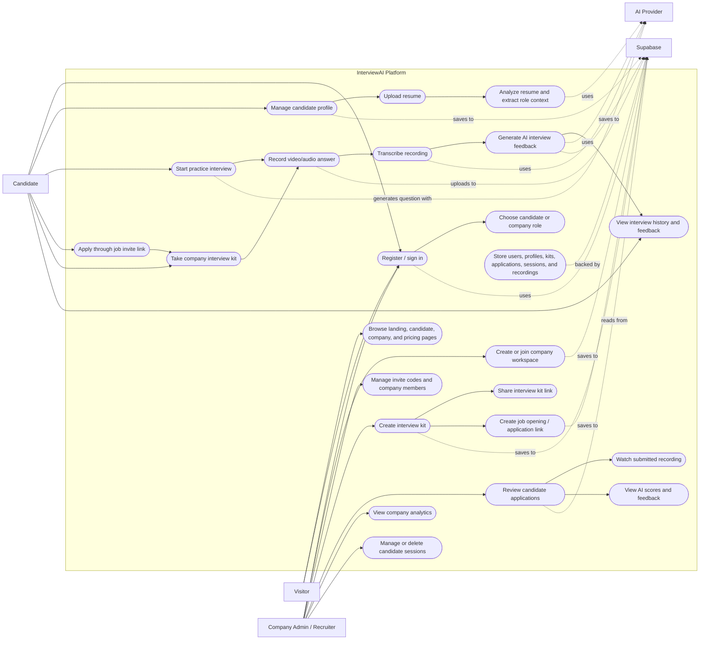
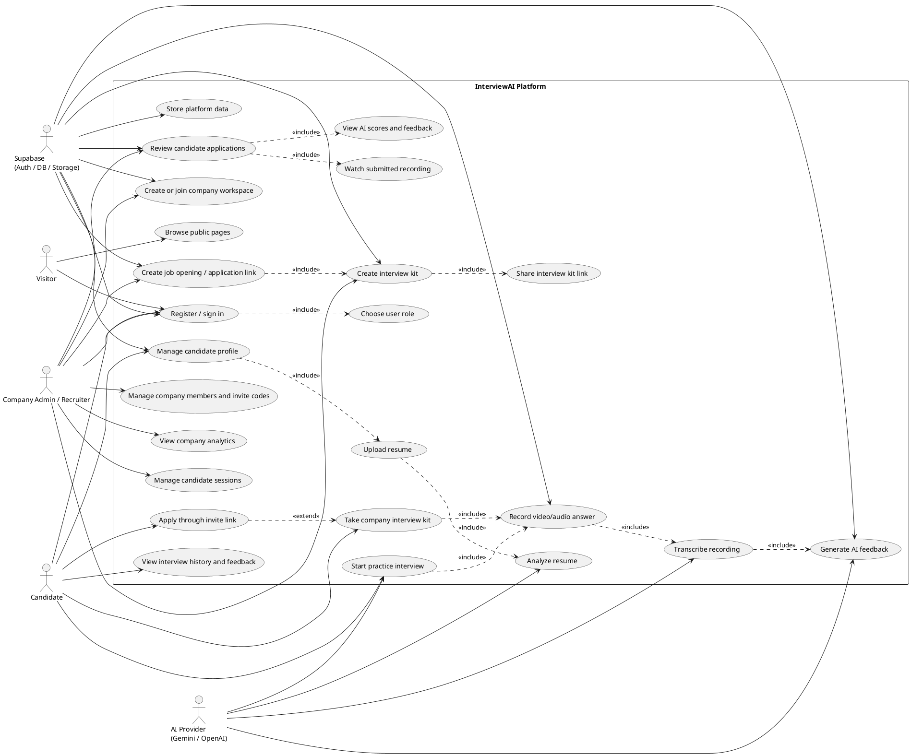

# InterviewAI Use Case Diagram

This document models the main use cases for the InterviewAI platform based on the current Next.js routes, API routes, Supabase schema, and interview components.

## Actors

- Visitor: unauthenticated user browsing the public site.
- Candidate: job seeker practicing interviews or completing company interview links.
- Company Admin/Recruiter: company user who creates interview kits, job openings, invite links, and reviews candidates.
- AI Provider: Gemini/OpenAI services used for question generation, resume analysis, transcription, and feedback.
- Supabase: authentication, database, and storage backend.

## Mermaid Diagram

## PlantUML Version

Use this version if your lecturer expects a more traditional UML use case diagram.

## Notes

- `Apply through invite link` maps to `/apply/[token]`.
- `Take company interview kit` maps to `/interview/kit/[id]/take`.
- Candidate account flows map to `/candidate/auth`, `/candidate/dashboard`, and `/candidate/profile`.
- Company account flows map to `/company/auth` and `/company/dashboard`.
- Supporting services include Supabase Auth/Database/Storage and Gemini/OpenAI AI processing.
